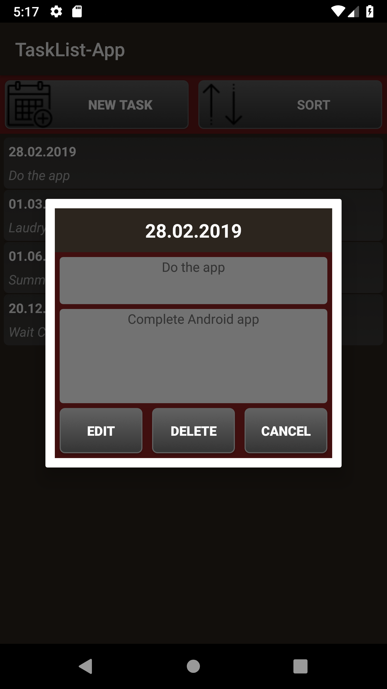
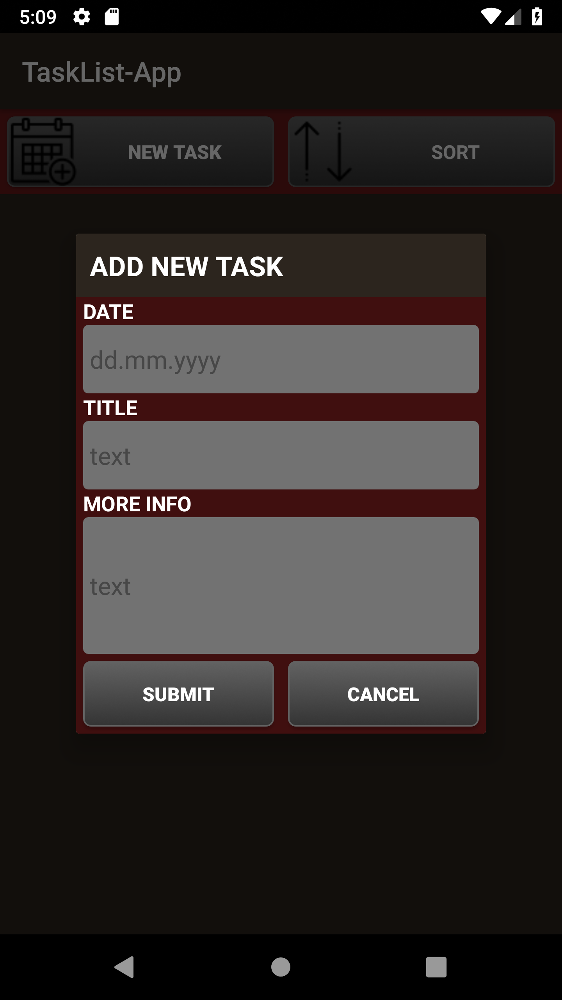
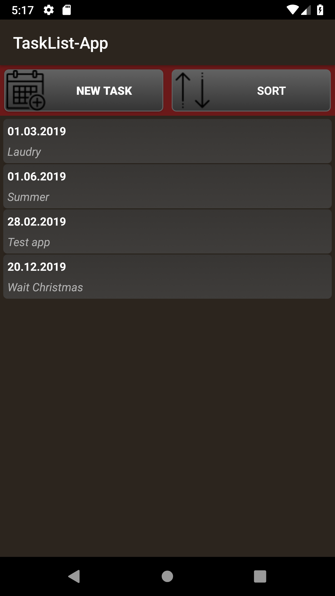

# TaskList app for Android

This app was part of Android Programming course\
Idea was to desing TaskList app that stores inserted tasks into SQLdatabase\
and it can be sorted by date or by alphabet to user view. And it had to have Edit, Delete and New Task functions

### Screenshots  

<table>
  <tr align="center">
    <td>Main view</td>
    <td>View Task Dialog</td>
    <td>New Task Dialog</td>
    <td>Sorted by alphabet</td>
  </tr>
  <tr>
    <td></td>
    <td></td>
    <td></td>
    <td></td>
  </tr>
</table>
  
